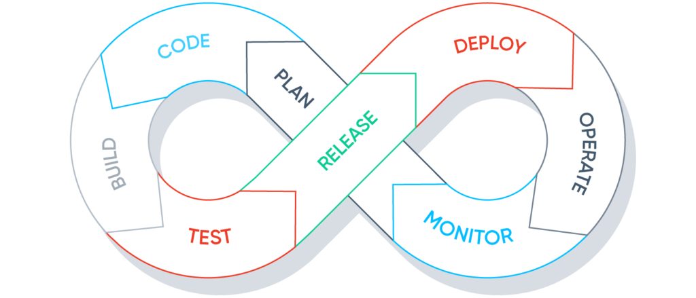

<h1 align="center">
  <br>
  <a href="http://github.com/zeet-co/layers"></a>
  <br>
  Layers
  <br>
</h1>

<h4 align="center">Layers is a Configuration Control Plane</h4>

<p align="center">
  <a href="#intro">Intro</a> •
  <a href="#install">Install</a> •
  <a href="#how-to-use">How To Use</a> •
  <a href="#roadmap">Roadmap</a>
</p>

## 👋 Intro 
### Configuration Management is Broken

Configuring applications with build pipelines, environment customizations, security & network policies, etc. is hard. It gets harder to do it for 10's or 100's of applications. Harder still to keep everything up-to-date. As a result, technical debt accumulates, and teams are sometimes left supporting legacy software delivery flows that are slow and error-prone.

`Layers` is a system for application developers and platform engineers to work together to create reusable configuration components, compose them together, and keep that them up-to-date automatically.

> 
>
>_Fig 1: The common DevOps process_
> 
> Some key benefits of DevOps:
> - Software engineers own their code end-to-end. They’re empowered and ultimately responsible for every line of code that’s running in production. This sense of ownership generally increases code quality, as well as application availability and reliability.
> - Teams are able to iterate rapidly and aren’t slowed down by months-long waterfall cycles. Instead, they can test new capabilities with real customers almost instantly.
> - Performance and reliability issues can be identified and addressed quickly. If a health metric drops right after the most recent deployment, rollbacks are auto-triggered, and the code change that triggered the deployment is a likely culprit.
>
> _Source: https://www.tecton.ai/blog/devops-ml-data/_

Unsolved problems:

- **Production-readiness typically requires high levels of coordination** between application, platform, and security engineers.
- **Vast amounts of configuration** are needed in order to complete the above loop.
- **Configuration quickly becomes out-dated**. Configuration isn't managed like code dependencies are, where `go get ./...` is all you need to update your libraries and get free bug/security fixes.
- **Lines easily blur** between reusable configuration and values that are application specific.
- **Multiplexing** application deployments with many environments exacerbates all above issues.

### Challenge #1 - Reusable and Composable Configuration

An example of reusable configuration is a Helm Chart or Terraform module. Both of these examples have limitations, in that the interface to the chart or module (values.yaml or variables.tf) must be explicit, and often it's next to impossible for the author to realistically know what values you may want to change. The amount of boilerplate needed to provide business logic, reasonable defaults, and flexibility is significant, often resulting in one or more of these features being missing.

This initial version of `Layers` will provide a simple mechanism for describing what configuration files that need to be generated based on conditions such as which environment.

```shell
$ ls
layer.cue layer.lock
```

```shell
$ layers gen .
$ tree
.
├── layer.cue 
├── layer.lock
├── .github
│   └── workflows
│       └── main.yml
├   Taskfile.yml 
└── environments
    ├── local
    │   └── docker-compose.yml
    ├── preview
    │   └── kubernetes
    │       ├── service.yml
    │       ├── deployment.yml
    │       ├── pod-disruption-budget.yml
    │       ├── redis.yml
    │       ├── postgres.yml
    │       └── ingress.yml
    ├── staging
    │   ├── kubernetes
    │   │   ├── service.yml
    │   │   ├── deployment.yml
    │   │   ├── pod-disruption-budget.yml
    │   │   ├── horizontal-pod-autoscaler.yml
    │   │   └── ingress.yml
    │   └── terraform
    │       └── main.tf.json
    └── production
        ├── kubernetes
        │   ├── service.yml
        │   ├── deployment.yml
        │   ├── pod-disruption-budget.yml
        │   ├── horizontal-pod-autoscaler.yml
        │   └── ingress.yml
        └── terraform
            └── main.tf.json
```

Because all the files generated are part of a single `layer.cue`, the Taskfile and github workflow files can become _aware_ of what other files and folders exist, and dynamically adapt based on context.  

`Layers` doesn't _execute_ things, but it can be used to generate files such as:

- [xyz_tool.cue](https://cuetorials.com/first-steps/scripting/)
- [Taskfile.yml](https://taskfile.dev/)
- [docker-compose.yml](https://docs.docker.com/compose/compose-file/)
- [procmux](https://github.com/napisani/procmux)
- [github workflow](https://docs.github.com/en/actions/using-workflows/workflow-syntax-for-github-actions)
- etc...

Which can _also_ be composed together to create very rich developer experiences.

### Challenge #2 - Automated Updates

You want to...

> Continuously detect the latest available versions

> See the exact commit histories and changelogs associated with the update without having to search or guess at where to look.

> Run your existing suite of tests on every update to avoid regression errors

> stay ahead of security issues, leverage the security community’s expertise, and use open source securely.

`Layers` integrates with [Renovatebot](https://docs.renovatebot.com/) to provide automated detection of `Layers` custom package files.

## Install

TBD

## How To Use

TBD

## Roadmap

- [ ] Develop a Roadmap

[cue]: https://cuelang.org/docs/about/
[layers]: https://github.com/zeet-dev/layers